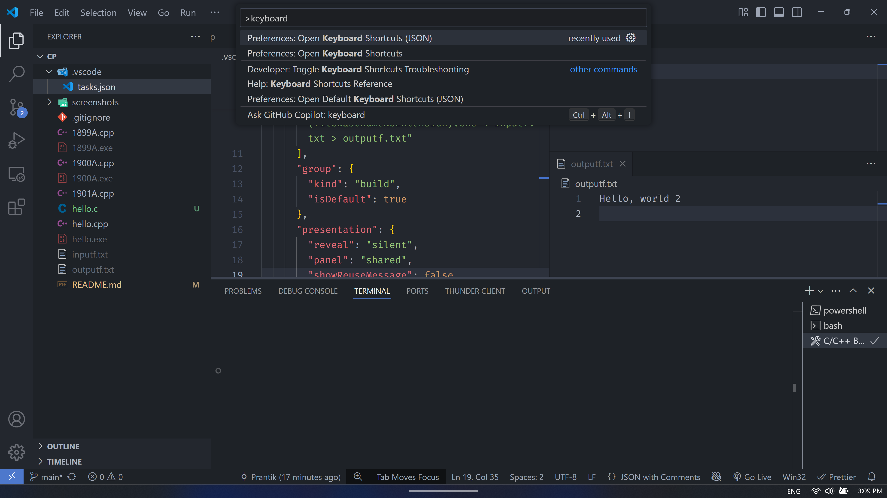

# Competitive Programming Solutions

This repository contains my solutions to various problem-solving and competitive programming challenges. Each folder or file represents a different problem or contest.

## Structure

- Organized by contest or topic
- Includes code, explanations, and sample inputs/outputs where applicable

## Purpose

- Practice algorithms and data structures
- Improve problem-solving skills
- Track progress over time

## How to Setup C/C++ in VS Code for CP in Windows


1. **Install VS Code** if you haven't already did it.  
   Download and install [Visual Studio Code](https://code.visualstudio.com/).

2. **Install MinGW**

- **Windows:** Install [MinGW](https://sourceforge.net/projects/mingw/files/latest/download)

3. **Install C/C++ Compiler**

   1. Run the installed **MinGW** file.
   2. Continue installing with the default configurations
   3. In the _Installation Manager_, right click on the **mingw32-gcc-g++** package and then _Mark for installation_. (If it is green, then mark any other package and unmark)
      
   4. Click on the **Installation** menu (on the top-left corner), then click on **Apply Changes**
   5. Click on **Apply**
      

4. **Setting Up Path Variables**

   1. Search "edit environment variables" on windows search bar
      
   2. After opening it, click on **Environment Variables**
      
   3. Select **PATH**, then click **Edit**
      
   4. Click on **New**, and add `C:\MinGW\bin`
      
   5. Click **OK**.

5. **Configure VS Code**  
   On your project, create `.vscode/tasks.json` file and paste the below code.

```json
{
  "version": "2.0.0",
  "tasks": [
    {
      "label": "C/C++ Build and Run",
      "type": "shell",
      "command": "cmd",
      "args": [
        "/C",
        "g++.exe -std=c++14 ${file} -o ${fileDirname}\\${fileBasenameNoExtension}.exe && ${fileDirname}\\${fileBasenameNoExtension}.exe < ${fileDirname}\\inputf.txt > ${fileDirname}\\outputf.txt"
      ],
      "group": {
        "kind": "build",
        "isDefault": true
      },
      "presentation": {
        "reveal": "never",
        "panel": "shared",
        "showReuseMessage": false
        // "clear": true
      },
      "problemMatcher": ["$gcc"]
    }
  ]
}
```

4. **Install Extensions**  
   In VS Code, go to Extensions and install:

- [**C/C++** (by Microsoft)](https://marketplace.visualstudio.com/items?itemName=ms-vscode.cpptools)

## Demo: Hello World in C++

Create a file named `hello.cpp`:

```cpp
#include <iostream>
using namespace std;

int main() {
  int i;
  cin >> i;
  cout << "Hello, Competitive Programming! " << i << endl;
}
```

Create files named `inputf.txt` and `outputf.txt`


To compile and run:

- Click on the **Terminal** in the menu bar.
- Click on **Run Build Task**.
- If you want to automate this, open the `keybindings.json` file. (*Ctrl+Shift+P*, then search "Keyboard", select the one with JSON)

- At the end of the list, And paste the below shortcut. (Ctrl+Shift+P, then search "Keyboard", select the one with JSON)
```json
{
  "key": "f9", // When you click on the F9 button, it will run your C/C++ code. If you want, you can change it.
  "command": "workbench.action.tasks.build",
  "when": "taskCommandsRegistered"
}
```

It will run the c++ code you are focused on taking input from `inputf.txt` and output to `outputf.txt`

You're ready to start coding!

Feel free to explore and learn!
